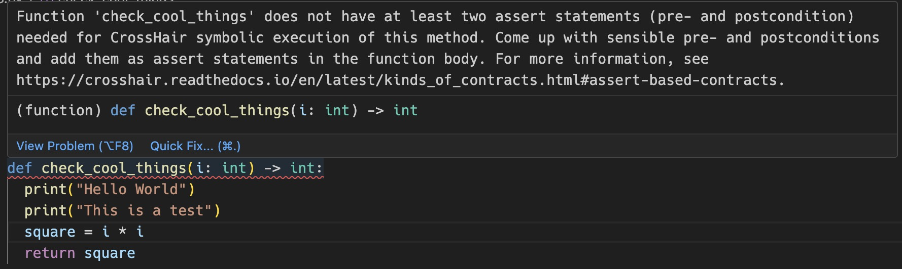
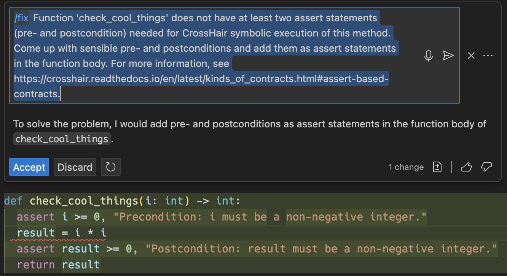
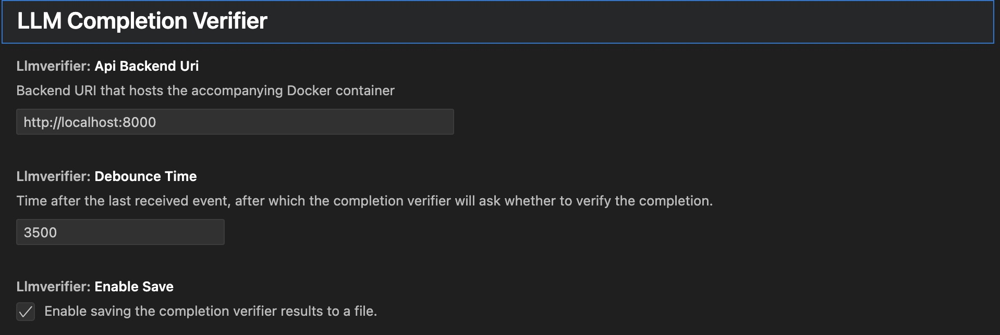

# copilot-verification
Verify GitHub Copilot outputs for Python with this VSCode Extension and accompanying Docker container.

## Preamble
:warning: **Disclaimer**: The code contained in this repository is provided for educational purposes only. By executing or using the code, you assume full responsibility for any consequences that may arise. The creators, contributors, or any associated parties shall not be liable for any direct, indirect, incidental, special, exemplary, or consequential damages (including, but not limited to, procurement of substitute goods or services; loss of use, data, or profits; or business interruption) however caused and on any theory of liability, whether in contract, strict liability, or tort (including negligence or otherwise) arising in any way out of the use of this code. Any liabilities arising from the violation of any plausible terms of use of GitHub Copilot or related services are explicitly disclaimed. Use this code at your own risk. :warning:

## Setup for the final architecture
The docker container depends on being run with `docker run --rm -p 8000:8000 ghcr.io/lukvonstrom/copilot-verification:main` please be aware that currently only amd64 architectures are supported.

### ARM based Macs
For ARM based Macs, intel emulation via rosetta needs to be used, as microsoft provides only `z3-solver` binaries for macos arm, but not for linux arm via pip.
Building Z3 from source is quite expensive, therefore emulation can be used like this (given that you manage docker via colima https://github.com/abiosoft/colima and have rosetta installed already https://support.apple.com/en-gb/102527):
`colima start --profile amd64 -a x86_64 -c 4 -m 6`

### Basic test of the extension
Now that everything is setup we can conduct a basic test as shown below:

The steps shown in the video are:
- Open the cloned repository in vscode.
- Open the folder containing the extension in vscode via `code code-extractor-extension`
- Click on `Run & Debug` - and there on the Play icon next to `Run Extension`
- In the newly spawned VsCode instance with the extension in debug mode, open a new python file
- Open the Command Bar with `CMD-SHIFT-P` 
- Select `copilot-verifier: Start Verification Session`
- A notification should appear and the Github Copilot Inline Chat Window should open itself.
- Prompt Copilot
- After a short delay, the verification will start, which is signified by a loading notification
- Next, a markdown with the verification results from the backend will open.

### Syntax Highlighting for missing pre- or postconditions
The extension automatically validates in the background that two `assert` statements are present in any method in the code.
If this is not the case, a syntax error will be displayed in the Editor at the specific method.

The error is verbose on purpose to facilitate an easier fix with Copilot. 
To now prompt copilot to fix this error, one simply has to invoke it inline by clicking on the impacted line and executing `CMD-I`.
Copilot subsequently will attempt to generate sensible pre- and postconditions to fix the error.

### Settings
The extension exposes the following settings:

With these settings, the URI of the Docker container is controllable, as well as the debounce time after which the LLM Verifier asks whether to verify the completion. When enabling save, results from the verification run are saved as markdown files in the same file.